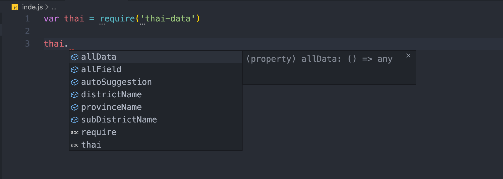

[](https://badge.fury.io/js/thai-data)

## รวมข้อมูล ตำบล อำเภอ และ จังหวัด ในประเทศไทย (77 จังหวัด) อ้างอิงตาม รหัสไปรษณีย์ไทย

- สำหรับคนที่สนใจอยาก contribute สามารถส่ง pull request มาได้ที่ https://github.com/niawjunior/thai-data

## ดูตัวอย่าง การนำไปใช้งาน https://thai-data.netlify.com/

## โค้ดตัวอย่าง (react) https://github.com/niawjunior/demo-thai-data

<br>

### วิธีติดตั้งใช้งาน

`npm i thai-data -s`

### วิธีเรียกใช้งาน

`var thai = require('thai-data')`

### ตัวอย่างโครงสร้าง ของข้อมูล


### มีทั้งหมด 6 function ด้วยกัน ดังนี้



### 1. เรียกดูข้อมูลที่มีอยู่ทั้งหมด (ทั่วประเทศ)

```javascript
var getAllData = thai.getAllData()

console.log(getAllData)

{
  zipCode: '46180',
    subDistrictList:
     [ [Object],
       [Object],
       [Object],
       [Object],
       [Object],
       [Object],
       [Object],
       [Object],
       [Object],
       [Object] ],
    districtList: [ [Object], [Object] ],
    provinceList: [ [Object] ]
},
{
  zipCode: '46190',
    subDistrictList:
     [ [Object], [Object], [Object], [Object], [Object], [Object] ],
    districtList: [ [Object] ],
    provinceList: [ [Object] ] },
{
  zipCode: '46230',
    subDistrictList: [ [Object], [Object], [Object], [Object], [Object] ],
    districtList: [ [Object] ],
    provinceList: [ [Object] ]
}
{
  ...
},
{
  ...
}
```

### 2. เรียกดูข้อมูลตามรหัสไปรษณีย์

```javascript
var getDataForZipCode = thai.getDataForZipCode(44130)

console.log(getDataForZipCode)

{ zipCode: '44130',
  subDistrictList:
   [ { subDistrictId: '440608',
       districtId: '482',
       provinceId: '32',
       subDistrictName: 'โนนแดง' },
     { subDistrictId: '440619',
       districtId: '482',
       provinceId: '32',
       subDistrictName: 'หนองโก' },
     { subDistrictId: '440607',
       districtId: '482',
       provinceId: '32',
       subDistrictName: 'โนนราษี' },
     { subDistrictId: '440618',
       districtId: '482',
       provinceId: '32',
       subDistrictName: 'หนองสิม' },
     { subDistrictId: '440606',
       districtId: '482',
       provinceId: '32',
       subDistrictName: 'กำพี้' },
     { subDistrictId: '440605',
       districtId: '482',
       provinceId: '32',
       subDistrictName: 'หนองม่วง' },
     { subDistrictId: '440616',
       districtId: '482',
       provinceId: '32',
       subDistrictName: 'ยาง' },
     { subDistrictId: '440604',
       districtId: '482',
       provinceId: '32',
       subDistrictName: 'วังไชย' },
     { subDistrictId: '440615',
       districtId: '482',
       provinceId: '32',
       subDistrictName: 'วังใหม่' },
     { subDistrictId: '440602',
       districtId: '482',
       provinceId: '32',
       subDistrictName: 'บ่อใหญ่' },
     { subDistrictId: '440613',
       districtId: '482',
       provinceId: '32',
       subDistrictName: 'หนองคูขาด' },
     { subDistrictId: '440601',
       districtId: '482',
       provinceId: '32',
       subDistrictName: 'บรบือ' },
     { subDistrictId: '440611',
       districtId: '482',
       provinceId: '32',
       subDistrictName: 'บัวมาศ' },
     { subDistrictId: '441205',
       districtId: '488',
       provinceId: '32',
       subDistrictName: 'ห้วยเตย' },
     { subDistrictId: '440610',
       districtId: '482',
       provinceId: '32',
       subDistrictName: 'หนองจิก' },
     { subDistrictId: '441204',
       districtId: '488',
       provinceId: '32',
       subDistrictName: 'หนองแวง' },
     { subDistrictId: '440620',
       districtId: '482',
       provinceId: '32',
       subDistrictName: 'ดอนงัว' },
     { subDistrictId: '441203',
       districtId: '488',
       provinceId: '32',
       subDistrictName: 'เลิงแฝก' },
     { subDistrictId: '441202',
       districtId: '488',
       provinceId: '32',
       subDistrictName: 'นาโพธิ์' },
     { subDistrictId: '441201',
       districtId: '488',
       provinceId: '32',
       subDistrictName: 'กุดรัง' } ],
  districtList:
   [ { districtId: '488', proviceId: '32', districtName: 'กุดรัง' },
     { districtId: '482', proviceId: '32', districtName: 'บรบือ' } ],
  provinceList: [ { provinceId: '32', provinceName: 'มหาสารคาม' } ] }

```

### 3. ข้อหาข้อมูลแบบอัตโนมัติ โดย ใช้รหัสไปรษณีย์ และ ตำบล หรือ ใช้รหัสไปรษณีย์ เพียงอย่างเดียว

#### 3.1 ใช้ รหัสไปรษณีย์เพียงอย่างเดียว

```javascript
var getAutoSuggestion = thai.getAutoSuggestion(44130)

console.log(getAutoSuggestion)

{ subDistrict:
   [ 'โนนแดง',
     'หนองโก',
     'โนนราษี',
     'หนองสิม',
     'กำพี้',
     'หนองม่วง',
     'ยาง',
     'วังไชย',
     'วังใหม่',
     'บ่อใหญ่',
     'หนองคูขาด',
     'บรบือ',
     'บัวมาศ',
     'ห้วยเตย',
     'หนองจิก',
     'หนองแวง',
     'ดอนงัว',
     'เลิงแฝก',
     'นาโพธิ์',
     'กุดรัง' ],
  districtName: null,
  provinceName: 'มหาสารคาม',
  zipCode: 44130 }

```

#### 3.2 ใช้ รหัสไปรษณีย์ และ ตำบล

```javascript
var getAutoSuggestion = thai.getAutoSuggestion(44130, 'เลิงแฝก')

console.log(getAutoSuggestion)

{
  subDistrict: 'เลิงแฝก',
  districtName: 'กุดรัง',
  provinceName: 'มหาสารคาม',
  zipCode: 44130
}

```

### 4. แสดงรายชื่อตำบลทั้งหมด ตามรหัสไปรษณีย์

```javascript
var getSubDistrictNames = thai.getSubDistrictNames(44130);

console.log(getSubDistrictNames)[
  ("โนนแดง",
  "หนองโก",
  "โนนราษี",
  "หนองสิม",
  "กำพี้",
  "หนองม่วง",
  "ยาง",
  "วังไชย",
  "วังใหม่",
  "บ่อใหญ่",
  "หนองคูขาด",
  "บรบือ",
  "บัวมาศ",
  "ห้วยเตย",
  "หนองจิก",
  "หนองแวง",
  "ดอนงัว",
  "เลิงแฝก",
  "นาโพธิ์",
  "กุดรัง")
];
```

### 5. แสดงรายชื่ออำเภอทั้งหมด ตามรหัสไปรษณีย์

```javascript
var getDistrictNames = thai.getDistrictNames(44130);

console.log(getDistrictNames)[("กุดรัง", "บรบือ")];
```

### 6. แสดงชื่อจังหวัด ตามรหัสไปรษณีย์

```javascript
var getProvinceName = thai.getProvinceName(44130);

console.log(getProvinceName);

มหาสารคาม;
```
